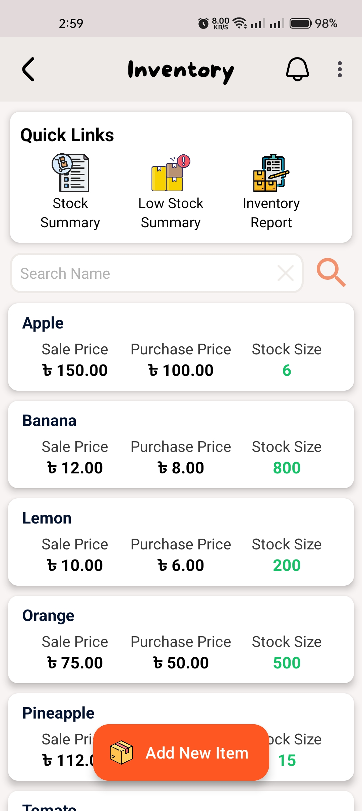
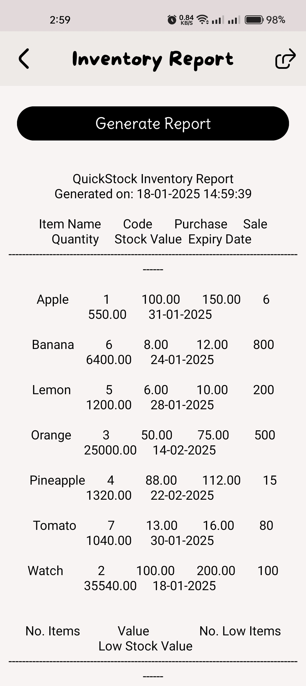

# QuickStock

QuickStock is an Inventory Management System designed to simplify and optimize the stock management process for small businesses. With features like product catalog management, low-stock alerts, sales tracking, and report generation, QuickStock helps businesses stay organized and efficient.

## Features

### 📦 Product Catalog Management
- Add, update, and delete product information.
- Categorize products for easier tracking.

### 🚨 Low-Stock Alerts
- Set minimum stock thresholds for products.
- Receive automatic alerts when stock levels fall below the defined thresholds.

### 💰 Sales Tracking
- Record sales transactions in real time.
- Monitor daily, weekly, or monthly sales.

### 📊 Report Generation
- Generate detailed reports on stock movement.
- View insights on product performance and sales trends.

## Technology Stack

- **Frontend**: Java (Android Development)
- **Backend**: Firebase Firestore Database

## Installation

Follow these steps to set up the QuickStock app on your local machine:

1. Clone the repository:
   ```bash
   git clone https://github.com/your-username/quickstock.git
   ```
2. Open the project in Android Studio.
3. Connect your Firebase project to the app by replacing the `google-services.json` file.
4. Build and run the app on an Android device or emulator.

## Usage

1. Launch the QuickStock app on your device.
2. Add products to your catalog with relevant details such as name, category, and stock levels.
3. Use the dashboard to monitor stock levels and sales.
4. Generate reports for better decision-making.

## Screenshots

### Home Page View


### Manage Inventory View


### Inventory Report View


## Contributing

Contributions are welcome! If you'd like to contribute to QuickStock, follow these steps:

1. Fork the repository.
2. Create a new branch:
   ```bash
   git checkout -b feature/your-feature-name
   ```
3. Commit your changes:
   ```bash
   git commit -m "Add your message here"
   ```
4. Push to the branch:
   ```bash
   git push origin feature/your-feature-name
   ```
5. Open a pull request.


## Contact

For any inquiries, feel free to reach out:
- **Developer**: Binoy Bhushan Barman Dipu
- **Email**: binoydipu@gmail.com

---

Thank you for using QuickStock! 😊
